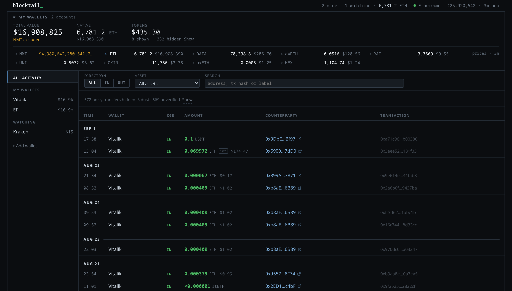
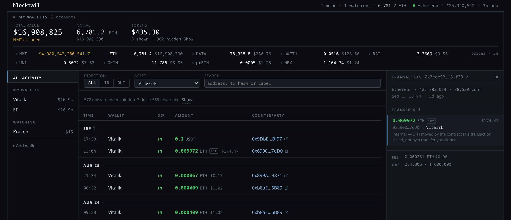
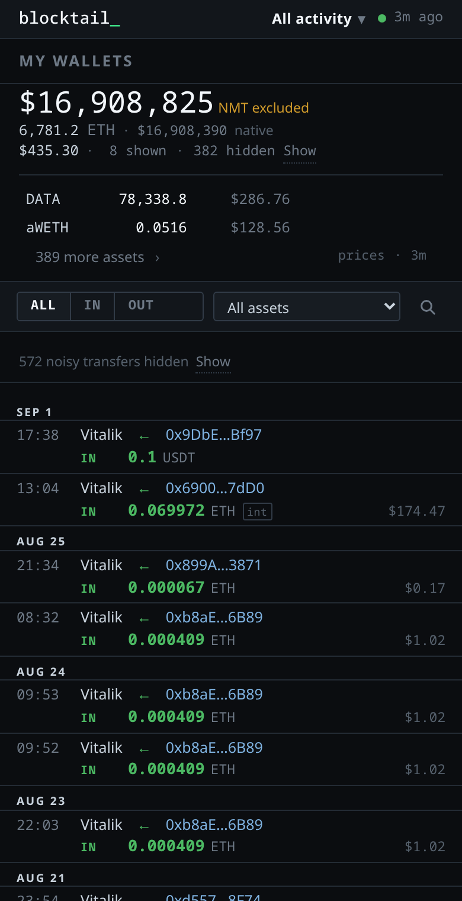

# blocktail

> `tail -f` for your wallets.

A small, self-hosted, **read-only** activity monitor for a fixed set of Ethereum
addresses. One page: the wallets you watch with their balances, and a single
chronological feed of everything that touched them.



*Live mainnet data. The struck-through NMT figure is a scam token whose nominal
quote would otherwise have made the total read $4.98 quadrillion — see
[Valuation](ARCHITECTURE.md#valuation). The 572 hidden transfers are dust and
tokens nothing vouches for; they are indexed and one click away.*

Clicking a row opens the transaction behind it. A feed is a list of transfers,
which is the right unit for scanning — but a swap is one thing that happened
and four rows in the index, so the transaction they share is a place you can
go rather than something the feed has to fold itself into a tree to show. Fee
and gas are read from the chain when you open it, not indexed:



On a phone it is not a folded table. The portfolio is one figure and a line
about it, the holdings are two rows and a sheet, and an event is two lines that
use the whole width — a compact log rather than a desktop in one column:



It never asks for a private key, a seed phrase, a wallet connection or a
signature, and it has no code path that could send a transaction.

## What it does

- Watches addresses listed in a YAML file or added from the page, validated
  before they are accepted.
- Separates wallets that are **yours** from addresses you are merely **watching**.
  Both are indexed and browsable; only yours are summed into a total.
- Indexes normal ETH transactions, ERC-20 transfers and internal ETH transfers
  into local SQLite. It does not re-fetch history on every page load.
- Collapses a transfer between two of your own wallets into one `Main → Cold`
  row rather than showing it twice.
- Names external addresses you have labelled, and falls back to a built-in
  list of about fifty well-known ones — routers, bridges, lending pools,
  exchange wallets. Everything else is truncated to `0x1234…abcd`, always
  linking through to Etherscan. Your labels always win.
- Folds a transaction's transfers into one entry led by the one carrying the
  value, and opens the whole transaction — every transfer, the fee, the gas —
  in an inspector docked beside the feed, or as a sheet on a phone.
- Hides dust and tokens nothing vouches for, counts the two apart, and says how
  many of each. Nothing is deleted: one click brings them back.
- Groups the feed by day — Today, Yesterday, then dates — and gives rows that
  arrive on an automatic refresh a brief highlight before they settle.
- Totals what you hold, across every wallet or one of them, in a collapsible
  panel: total value, native, tokens, and each asset aggregated across accounts.
  Clicking an asset filters the feed to it; collapsed, the panel is one line.
- Filters by wallet, direction and asset, with text search across addresses,
  transaction hashes and labels — no page reload.
- On a wide screen the content is capped at 1440px and centred, with the top bar,
  filters and table head sticky as the page scrolls.
- On a phone it is not a squeezed desktop. The scope lives in the top bar, the
  portfolio is one figure and a line about it, holdings are capped at two with
  the rest a tap away, and an event is two lines using the whole width — so the
  screen is spent on activity rather than on navigation and repetition.
- Refreshes itself, and says so loudly when synchronization has stopped or the
  upstream provider is unavailable. It never presents stale data as current.

## What it deliberately is not

No accounts, no login, no JWT, no wallet connection, no signing, no sending, no
key management, no NFT gallery, no alerts, no bots, no admin panel, and no
multi-chain support. Ethereum mainnet only.

Balances **are** valued in USD, because a total across ETH, USDC and WETH is
meaningless without it. That is where valuation stops: there is no cost basis,
no P&L, no 24h change, no tax reporting and no price history — all of which need
a valuation methodology this tool deliberately does not have.

---

## Quick start

You need a free Alchemy API key for Ethereum mainnet
(<https://dashboard.alchemy.com>).

```bash
git clone <your-fork> blocktail && cd blocktail

cp .env.example .env                 # then put your key in ALCHEMY_API_KEY
cp wallets.example.yml wallets.yml   # then put your addresses in it

docker compose up -d --build
```

The dashboard is on <http://127.0.0.1:8000>. The first start indexes
`BACKFILL_DAYS` of history (90 by default) and shows a *building the initial
index* state until it finishes.

### Running it without Docker

```bash
python -m venv .venv && .venv/bin/pip install -r requirements.txt
export ALCHEMY_API_KEY=...
.venv/bin/uvicorn app.main:main --factory --host 127.0.0.1 --port 8000
```

---

## Configuration

### `wallets.yml`

```yaml
chain: ethereum          # optional; the default and only accepted value

wallets:                 # "accounts:" works too
  - name: Main
    chain: ethereum      # optional per wallet
    address: "0x5aAeb6053F3E94C9b9A09f33669435E7Ef1BeAed"

  - name: Cold
    address: "0xfB6916095ca1df60bB79Ce92cE3Ea74c37c5d359"

  - name: "Whale #1"     # watched, not mine
    address: "0xD1220A0cf47c7B9Be7A2E6BA89F429762e7b9aDb"
    owned: false

labels:                  # optional names for external addresses
  "0x28C6c06298d514Db089934071355E5743bf21d60": "Binance"

ignore_assets: []        # optional contracts to hide (airdropped spam)
```

Airdropped spam is not a hypothetical: on live mainnet data, every address
tested — including Vitalik's and the Ethereum Foundation's — held more than 200
ERC-20s, of which only a couple of dozen had any market price at all. The feed
sorts unpriced assets last and the dashboard caps how many it shows, so they
stay out of the way; `ignore_assets` is how you make specific ones disappear.

### Mine, or just watched

`owned` defaults to `true`. An account with `owned: false` is indexed exactly
like your own — full history, balances, its own wallet view — but is never added
to any total, because summing someone else's balance into yours means nothing.
The sidebar keeps the two apart, and each group heading is also the control that
narrows the feed to it — click it again to go back to everything:

```
Main       $35.7k
Cold      $123.5k
Payments    $1.8k

WATCHING        2     ← click: only the ones I watch
Whale #1   $29.8m
Vitalik       $4m

+ Add wallet
```

With nothing selected the feed shows every monitored address. The summary panel
above always totals **only what is yours**, whichever scope the feed is in —
adding someone else's balance to your own would make the number meaningless.
Selecting a watched address does open its own summary, marked `WATCHING`.

A transfer between two accounts blocktail knows is stored once and read from
wherever you are standing:

```
All activity      12:17  Main → Whale #1        5 ETH
My wallets        12:17  Main       OUT         5 ETH   Whale #1
Whale #1          12:17  Whale #1   IN          5 ETH   Main
```

### Adding a wallet from the page

`+ Add wallet` in the sidebar takes a name, an address, a chain, and an
*Include in my portfolio* checkbox — unticked lands it under **Watching**.

Accounts added this way live in the database, not in `wallets.yml`, so a config
reload never removes them and the file stays yours to format. Their history is
backfilled on the next sync rather than starting from the current block. Only
accounts added here can be removed here; the ones the config declares belong to
the file.

Addresses are validated on startup — length, hex, and the EIP-55 checksum when
one is present, so a typo is caught before it becomes an address you silently
fail to monitor. Every problem in the file is reported at once.

The file is re-read on every start. Adding a wallet re-attributes history that
was already indexed; removing one keeps its history and simply stops showing it.

`wallets.yml` and `.env` are gitignored — they hold your addresses and your key.

### Environment

| Variable | Default | Meaning |
| --- | --- | --- |
| `ALCHEMY_API_KEY` | *(required)* | Provider key. Server-side only; never reaches the browser. |
| `ALCHEMY_URL` | — | Full provider URL, overriding the key. |
| `BLOCKTAIL_CONFIG` | `wallets.yml` | Path to the wallet file. |
| `BLOCKTAIL_DB` | `data/blocktail.db` | SQLite path. |
| `SYNC_INTERVAL_SECONDS` | `90` | How often to look for new activity. |
| `BACKFILL_DAYS` | `90` | How far back the feed reaches. |
| `REORG_DEPTH` | `64` | Blocks re-scanned each cycle to correct reorgs. |
| `AUTH_USER` / `AUTH_PASSWORD` | *(unset)* | Require HTTP basic auth when both are set. |
| `MAX_TOKEN_BALANCES` | `10` | Token balances shown per wallet. |
| `MAX_TOKEN_LOOKUPS` | `200` | Cap on token metadata lookups per wallet per sync. |
| `DUST_BELOW_USD_CENTS` | `100` | A holding under this must earn its place another way. |
| `DUST_TRANSFER_USD_CENTS` | `1` | A transfer under this is hidden from the feed. |
| `PRICES` | `on` | `off` disables USD valuation entirely. |
| `PRICE_REFRESH_SECONDS` | `300` | How often to re-price holdings. |
| `ALCHEMY_PRICES_URL` | Alchemy's | Override the pricing base URL. |
| `STALE_AFTER_SECONDS` | `3 × interval` | When the UI starts warning about staleness. |
| `HOST` / `PORT` | `0.0.0.0` / `8000` | Bind address inside the container. |
| `HOST_PORT` | `8000` | Loopback port published on the host. |
| `TZ` | `UTC` | Timezone for clock times and Today/Yesterday headings. |
| `LOG_LEVEL` | `INFO` | |

---

## Provider usage and the free tier

Each cycle costs two `alchemy_getAssetTransfers` calls per wallet (one per
direction — the API ANDs `fromAddress` and `toAddress`, so they cannot be
combined) plus a balance and a token-balance call:

```
monthly CU  ≈  wallets × 275 × (2,592,000 / SYNC_INTERVAL_SECONDS)
```

Valuation adds two Prices API calls per `PRICE_REFRESH_SECONDS` regardless of
how many wallets you watch, which is negligible next to the figures below.

Approximate monthly compute units:

| Wallets | 30 s | 60 s | **90 s** | 300 s |
| --- | --- | --- | --- | --- |
| 3 | 71 M | 36 M | **24 M** | 7 M |
| 5 | 119 M | 59 M | **40 M** | 12 M |
| 10 | 238 M | 119 M | **79 M** | 24 M |

The 90-second default keeps three or four wallets inside a 30 M/month free
allowance. With more wallets, raise the interval or expect to pay — at
pay-as-you-go rates the overage is cents per month rather than dollars. Check
your provider's current tier before lowering the interval; the figure above was
correct at the time of writing but is not something this app can verify.

Both the backfill and the re-scan window are bounded, so cost does not grow with
the size of your history.

---

## Deployment

### What you need

1. **A VPS with Docker.** Nothing else is installed on the host.
2. **An Alchemy API key** for Ethereum mainnet, free tier — <https://dashboard.alchemy.com>.
   It is used for both chain data and USD valuation.
3. **The addresses you want to watch**, in checksummed or lowercase form.
4. **Something in front of the app for access control** — Caddy/nginx, or a
   Tailscale tailnet. blocktail can also require a login of its own (below), but
   that is a second lock rather than a replacement for TLS.

### First run

```bash
git clone <your-fork> blocktail && cd blocktail

cp .env.example .env                 # put your key in ALCHEMY_API_KEY, set TZ
cp wallets.example.yml wallets.yml   # put your addresses in it

docker compose up -d --build
docker compose logs -f               # watch the first sync
```

Create both files **before** the first `up`: Docker turns a missing bind-mount
source into a directory, and the app will refuse to start with an explanation.

Permissions matter here, in opposite directions:

```bash
chmod 600 .env          # the API key and the password — root only
chmod 644 wallets.yml   # addresses, and the container reads it unprivileged
```

Docker reads `.env` itself, as root, before the container exists. `wallets.yml`
is bind-mounted and read by the app, which does not run as root — at `600` it is
unreadable inside the container.

The first start indexes `BACKFILL_DAYS` of history (90 by default). For a busy
wallet that is the most provider quota the app will ever spend at once — lower
it for the first run if you want to be careful, then raise it.

Expect these lines:

```
blocktail: watching 3 wallet(s) on ethereum: Main, Cold, Payments
app.sync: sync ethereum: blocks 25679736-25895736, 412 fetched, 412 new, 0 pruned in 6.1s
```

`GET /healthz` should then return `"status": "ok"`, and the page should show a
green dot with a recent block number.

### Authentication

Set `AUTH_USER` and `AUTH_PASSWORD` in `.env` and every route requires HTTP
basic auth. Leave either empty and the instance is open — it logs a warning
saying so on every start.

`/healthz` stays open so the container healthcheck can reach it, and while auth
is on it answers with nothing but `{"status": "ok"}`.

This is worth knowing: basic auth sends the password on every request, only
base64-encoded. Over plain HTTP that is the same as sending it in the clear.
Terminate TLS in front of it, or keep it on a private network. The login stops
a passer-by, not someone on the path.

### Behind a reverse proxy

`docker-compose.yml` publishes to `127.0.0.1:${HOST_PORT:-8000}` only — set
`HOST_PORT` in `.env` if that port is taken. Do not bind it to `0.0.0.0` unless
something else already protects it.

```
watch.example.com {
    basic_auth {
        you $2a$14$...            # caddy hash-password
    }
    reverse_proxy 127.0.0.1:8000
}
```

Over Tailscale, skip the proxy and reach the VPS's tailnet address directly.

### One worker

The indexer runs inside the web process. Do not add `--workers` or set
`WEB_CONCURRENCY`: each worker would run its own indexer against the same
database and the same provider quota. Storing is idempotent so nothing breaks,
but it wastes calls. The app logs a warning if it sees more than one.

### Persistence

Indexed history lives in the `blocktail-data` named volume, mounted at `/data`.
It survives `docker compose down`, image rebuilds and container restarts; only
`docker compose down -v` destroys it. Restarting never duplicates events.

To back up:

```bash
docker compose exec blocktail python -c \
  "import sqlite3; sqlite3.connect('/data/blocktail.db').backup(sqlite3.connect('/data/backup.db'))"
docker compose cp blocktail:/data/backup.db ./blocktail-backup.db
```

Schema changes ship as migrations and are applied on start, so upgrading is
`git pull && docker compose up -d --build`. The database is never recreated.

### Health

`GET /healthz` reports liveness and stays `200` while the provider is down —
a provider outage should not make the orchestrator restart a container that is
serving correctly. The degraded state is in the response body, in
`GET /api/status`, and shown in red at the top of the dashboard.

---

## Security notes

- Read-only. No key, seed phrase, wallet connection or signing path exists.
- The provider key stays server-side; it is never rendered into HTML or exposed
  by any endpoint.
- The only writes the web layer accepts are to the watch list: adding an address
  to monitor and removing one that was added there. Nothing else is mutable, and
  nothing touches the chain.
- Those two routes check `Sec-Fetch-Site`/`Origin` so another site cannot post
  to them through your browser. That is not a substitute for the access control
  in front of the app — it is the layer under it.

---

## JSON API

Small, and deliberately chain-neutral in its field names.

| Endpoint | |
| --- | --- |
| `GET /api/activity` | Feed page. `wallet`, `scope`, `direction`, `asset`, `q`, `before` |
| `GET /api/accounts` | Monitored accounts with balances and ownership |
| `GET /api/portfolio` | Holdings and valuation. `wallet` narrows the scope |
| `GET /api/status` | Sync state, head block, last error |
| `GET /healthz` | Liveness |

---

## Development

```bash
python -m venv .venv
.venv/bin/pip install -r requirements-dev.txt
.venv/bin/python -m pytest
```

The suite covers the indexer (identity, idempotency, restart, reorg pruning,
provider failure), the provider's parsing against recorded Alchemy payloads, the
HTTP layer (filters, search, pagination, status states) and configuration
validation. It needs no API key and makes no network calls.

[ARCHITECTURE.md](ARCHITECTURE.md) covers the provider choice and its
limitations, the schema, and how events are normalized and deduplicated.

---

## License

MIT — see [LICENSE](LICENSE).
